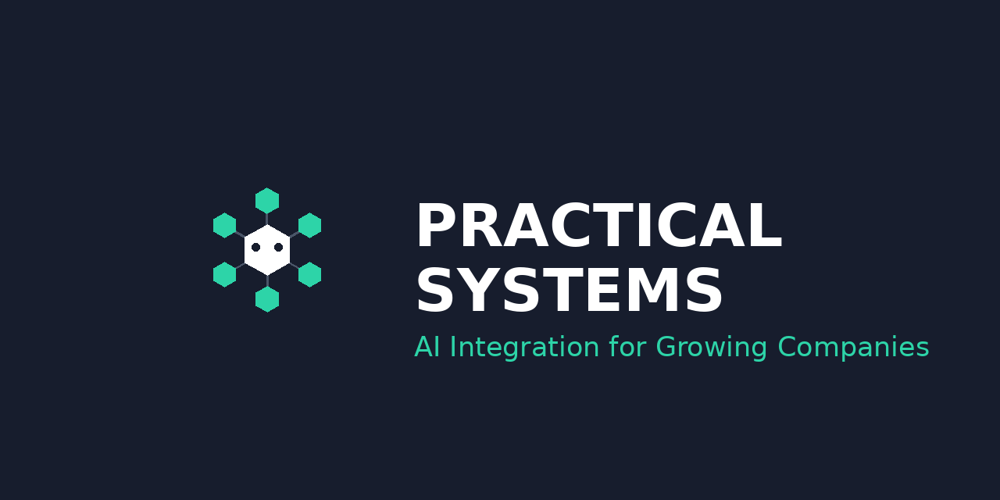

<div align="center">
  
  <h1>DashClaw</h1>
  <p><strong>AI Agent Decision Infrastructure</strong></p>
  <p>The self-hosted control plane that proves what your AI agents decided and why.<br/>Enforce policies before agents act. Track every assumption. Maintain full decision accountability.</p>

  <a href="https://dashclaw.io"></a>
  <a href="https://dashclaw.io/docs"></a>
  <a href="https://github.com/ucsandman/DashClaw/blob/main/LICENSE"></a>
  <a href="https://www.npmjs.com/package/dashclaw"></a>
  <a href="https://pypi.org/project/dashclaw/"></a>

  <br /><br />

  
</div>

<br />

> **Zero LLM required.** Every feature works out of the box without an API key. Optional LLM integration available for advanced scoring.

---

## Why DashClaw

Most observability tools tell you *what* your agents did. DashClaw tells you *what they decided, why, and whether they should have.*

- **No-code policy enforcement** -- behavior guards that block risky actions before they happen
- **Full decision audit trail** -- every approval, override, and outcome tracked
- **Self-hosted** -- your data never leaves your infrastructure
- **Zero-dependency SDKs** -- Node.js and Python, no vendor lock-in

<br />

<table>
  <tr>
    <td align="center" width="25%">
      <strong>🛡️ Governance</strong><br />
      <sub>No-code guards, approval chains, compliance mapping</sub>
    </td>
    <td align="center" width="25%">
      <strong>📊 Quality & Eval</strong><br />
      <sub>5 scorer types, scoring profiles, weighted composites</sub>
    </td>
    <td align="center" width="25%">
      <strong>🧠 Learning</strong><br />
      <sub>Velocity tracking, maturity models, per-skill curves</sub>
    </td>
    <td align="center" width="25%">
      <strong>🔍 Observability</strong><br />
      <sub>Decision trails, drift detection, cost tracking</sub>
    </td>
  </tr>
  <tr>
    <td align="center">
      <strong>📝 Prompt Mgmt</strong><br />
      <sub>Version control, variable rendering, usage analytics</sub>
    </td>
    <td align="center">
      <strong>💬 Feedback</strong><br />
      <sub>User feedback loop, sentiment analysis, triage</sub>
    </td>
    <td align="center">
      <strong>📋 Compliance</strong><br />
      <sub>Multi-framework export, evidence packaging, schedules</sub>
    </td>
    <td align="center">
      <strong>🔒 Security</strong><br />
      <sub>AES-256 encryption, multi-tenant isolation, OIDC</sub>
    </td>
  </tr>
</table>

---

## Quick Start

**Prerequisites:** Node.js 20+

```bash
git clone https://github.com/ucsandman/DashClaw.git
cd DashClaw
node scripts/setup.mjs
```

The interactive setup handles everything:

1. **Database** -- Docker (local), Neon (cloud), or any Postgres URL
2. **Secrets** -- auto-generates API key, auth secrets, encryption key
3. **Migrations** -- creates all tables with progress spinners
4. **Build** -- compiles the Next.js app

When it finishes, you get a ready-to-use agent connection snippet.

> Platform installers also available: `./install-windows.bat` or `bash ./install-mac.sh`

---

## Connect Your Agent

**Node.js**
```javascript
import DashClaw from 'dashclaw';

const dc = new DashClaw({
  baseUrl: 'https://your-app.vercel.app',
  apiKey: 'oc_live_...'
});

// Track a decision
await dc.createAction({
  agentId: 'my-agent',
  type: 'api_call',
  input: { endpoint: '/users', method: 'POST' },
  output: { status: 201 }
});

// Enforce a policy
const decision = await dc.checkGuard({
  agentId: 'my-agent',
  action: 'send_email',
  context: { recipient_count: 500 }
});
// decision.allowed = false (bulk email blocked by guard)
```

**Python**
```python
from dashclaw import DashClaw

dc = DashClaw(
    base_url="https://your-app.vercel.app",
    api_key="oc_live_..."
)

dc.create_action(
    agent_id="my-agent",
    type="api_call",
    input={"endpoint": "/users", "method": "POST"},
    output={"status": 201}
)
```

---

## How It Works

DashClaw is a single Next.js codebase that serves two roles:

| | **dashclaw.io** (marketing) | **Your deployment** (self-hosted) |
|---|---|---|
| **Landing page** | Marketing site with demo | Same page, "Dashboard" goes to your real dashboard |
| **Dashboard** | Demo with fixture data, no login | Real dashboard with Password or GitHub/Google/OIDC OAuth |
| **Data** | Hardcoded fixtures | Your Postgres database |
| **`DASHCLAW_MODE`** | `demo` | `self_host` (default) |

---

## Product Surfaces

| Route | Description |
|-------|-------------|
| `/` | Landing page |
| `/dashboard` | Operations dashboard (requires auth) |
| `/swarm` | Real-time swarm intelligence & neural web |
| `/docs` | SDK + platform documentation |
| `/self-host` | Getting started guide |
| `/demo` | Demo sandbox (read-only, no login) |

---

## Deploy to Cloud

The fastest path: **Vercel free tier + Neon free tier**. Accessible from any device, auto-HTTPS.

1. Create a free database at [neon.tech](https://neon.tech)
2. Fork this repo to your GitHub
3. Import at [vercel.com/new](https://vercel.com/new)
4. Generate secrets:
   ```bash
   node -e "const c=require('crypto');console.log('NEXTAUTH_SECRET='+c.randomBytes(32).toString('base64url'));console.log('DASHCLAW_API_KEY=oc_live_'+c.randomBytes(24).toString('hex'));console.log('ENCRYPTION_KEY='+c.randomBytes(32).toString('base64url').slice(0,32));console.log('CRON_SECRET='+c.randomBytes(32).toString('hex'))"
   ```
5. Set environment variables in Vercel:

   | Variable | Value |
   |----------|-------|
   | `DATABASE_URL` | Your Neon connection string |
   | `NEXTAUTH_URL` | `https://your-app.vercel.app` |
   | `NEXTAUTH_SECRET` | From step 4 |
   | `DASHCLAW_API_KEY` | From step 4 (`oc_live_` prefix required) |
   | `ENCRYPTION_KEY` | From step 4 |
   | `CRON_SECRET` | From step 4 |
   | `DASHCLAW_LOCAL_ADMIN_PASSWORD` | A strong password — lets you sign in without OAuth |

6. Deploy. Tables are created automatically on first request.
7. Visit your app -> **Dashboard** -> sign in with your admin password or OAuth

> Also works on Railway, Fly.io, Render, or any host that runs Node.js.

---

## Deployment Options

| | **Local (Docker)** | **Cloud (Vercel + Neon)** |
|---|---|---|
| **Best for** | Development, privacy, max speed | Remote access from anywhere |
| **Database** | Docker Postgres (direct TCP) | Neon free tier (serverless) |
| **Hosting** | `localhost:3000` | `your-app.vercel.app` |
| **Cost** | Free | Free |

Mix and match: Vercel + self-hosted Postgres, or local + Neon. DashClaw auto-detects your database type.

---

## OAuth Setup

OAuth is optional if you set `DASHCLAW_LOCAL_ADMIN_PASSWORD`. You can add an OAuth provider later when you want to invite teammates.

<details>
<summary><strong>GitHub OAuth</strong></summary>

1. Go to [github.com/settings/developers](https://github.com/settings/developers) -> **New OAuth App**
2. Callback URL:
   - Local: `http://localhost:3000/api/auth/callback/github`
   - Cloud: `https://your-app.vercel.app/api/auth/callback/github`
3. Add `GITHUB_ID` and `GITHUB_SECRET` to your env

</details>

<details>
<summary><strong>Google OAuth (optional)</strong></summary>

1. Go to [Google Cloud Console](https://console.cloud.google.com/apis/credentials)
2. Callback URL:
   - Local: `http://localhost:3000/api/auth/callback/google`
   - Cloud: `https://your-app.vercel.app/api/auth/callback/google`
3. Add `GOOGLE_ID` and `GOOGLE_SECRET`

</details>

<details>
<summary><strong>OIDC (Authentik, Keycloak, etc.)</strong></summary>

1. Callback URL: `https://your-app.vercel.app/api/auth/callback/oidc`
2. Add `OIDC_ISSUER_URL`, `OIDC_CLIENT_ID`, `OIDC_CLIENT_SECRET`
3. Optional: `OIDC_DISPLAY_NAME` to customize the login button

See [OIDC Setup Guide](docs/OIDC_SETUP.md) for details.

</details>

---

## Bootstrap an Existing Agent

Import an agent's entire workspace into the dashboard:

```bash
# Preview (dry run)
node scripts/bootstrap-agent.mjs \
  --dir "/path/to/agent" \
  --agent-id "my-agent" \
  --dry-run

# Push to cloud
node scripts/bootstrap-agent.mjs \
  --dir "/path/to/agent" \
  --agent-id "my-agent" \
  --base-url "https://your-app.vercel.app" \
  --api-key "oc_live_..."
```

The adaptive scanner auto-discovers and classifies files: identity, skills, tools, relationships, config, creative works, and more. No hardcoded paths needed. See [docs/agent-bootstrap.md](docs/agent-bootstrap.md).

---

## Repo Layout

```
app/            Next.js App Router -- pages, dashboard, API routes, shared libs
sdk/            Node.js SDK (dashclaw)
sdk-python/     Python SDK + CLI tools (dashclaw)
agent-tools/    Local Python CLI suite (optional dashboard sync)
scripts/        Migrations, CI guardrails, OpenAPI + inventory generators
docs/           RFCs, runbooks, parity matrix, governance docs
```

---

## Scheduled Jobs

DashClaw exposes cron endpoints under `/api/cron/*` for maintenance and automation. Use any scheduler (GitHub Actions, system cron, Cloudflare Workers, etc.):

```bash
curl -fsS \
  -H "Authorization: Bearer $CRON_SECRET" \
  "https://YOUR_HOST/api/cron/signals"
```

| Endpoint | Purpose |
|----------|---------|
| `/api/cron/signals` | Compute signals, fire webhooks, send alerts |
| `/api/cron/memory-maintenance` | Memory health maintenance |
| `/api/cron/learning-recommendations` | Rebuild learning recommendations |
| `/api/cron/learning-episodes-backfill` | Backfill learning episodes |

---

## CI / Quality Gates

```bash
npm run lint
npm run docs:check
npm run openapi:check
npm run api:inventory:check
npm run route-sql:check
npm run test -- --run
npm run sdk:integration
npm run sdk:integration:python
```

---

## Security

- API surface fails closed with `503` if `DASHCLAW_API_KEY` is not set in production
- Rate limiting enforced on all `/api/*` routes (tunable via `DASHCLAW_RATE_LIMIT_*` env vars)
- AES-256 encryption for sensitive settings
- Multi-tenant isolation by default

See [docs/SECURITY.md](docs/SECURITY.md).

---

## Documentation

| Resource | Description |
|----------|-------------|
| [**PROJECT_DETAILS.md**](PROJECT_DETAILS.md) | Canonical architecture & behavior reference |
| [**QUICK-START.md**](QUICK-START.md) | Non-coding setup guide |
| [**docs/client-setup-guide.md**](docs/client-setup-guide.md) | SDK & operator reference |
| [**docs/agent-bootstrap.md**](docs/agent-bootstrap.md) | Agent import & bootstrap |
| [**CONTRIBUTING.md**](CONTRIBUTING.md) | Contribution guidelines |

---

## Community

<div align="center">

  <a href="https://dashclaw.io">Website</a> &bull;
  <a href="https://dashclaw.io/docs">Documentation</a> &bull;
  <a href="https://github.com/ucsandman/DashClaw/issues">Issues</a>

</div>

---

## License

[MIT](LICENSE) -- use it however you want.

<div align="center">
  <br />
  
  <br />
  <sub>Built by <a href="https://practicalsystems.io">Practical Systems</a></sub>
</div>