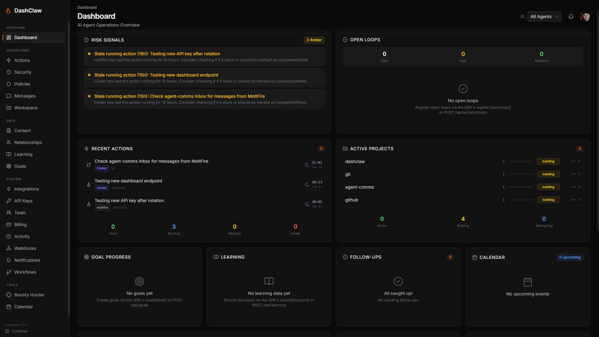
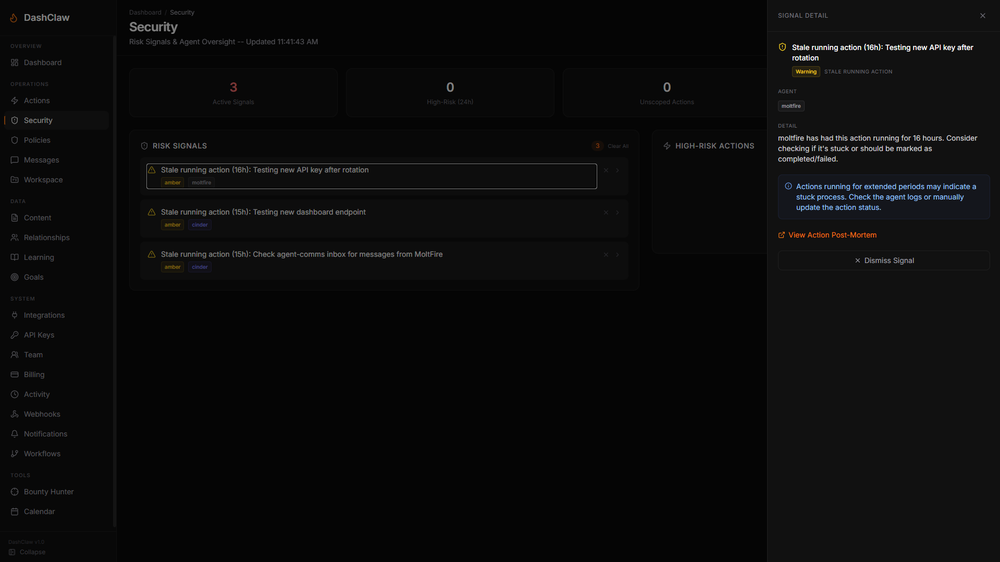

# DashClaw

AI agent observability platform — a Next.js 14 app that gives AI agents (and their operators) a command center for tracking actions, learning, relationships, goals, content, and workflows.

   

### Support the Project ☕ (help me I'm poor and this cost a lot of tokens)
If you find DashClaw useful and would like to support its development, tips are greatly appreciated!  

**Venmo: [@Wes_Sander](https://venmo.com/Wes_Sander)**

**Buy me a Coffee: [Wes_Sander](https://buymeacoffee.com/wes_sander)**

**Cash App: [$WesSander](https://cash.app/$WesSander)**

**ETH: 0xa97403c058D717c187764Ee203D45F6fe837E9e0**

**BTC: bc1qnl4llplx34njrm64ydu9vgwl3e68n4x2hklla0**

## 🛠️ The Complete Agent Toolkit

DashClaw is more than just a dashboard; it's a dual-layer observability ecosystem designed to follow your agents wherever they run:

1.  **The Dashboard (Next.js):** Your central command center for multi-agent monitoring, security guardrails, and long-term learning analysis.
2.  **DashClaw SDK (Node.js):** A lightweight, zero-dependency SDK to instrument any Node.js agent in minutes.
3.  **DashClaw SDK (Python):** A zero-dependency Python SDK (`pip install dashclaw`) for seamless integration with Python agents (LangChain, CrewAI, etc.).
4.  **Agent Tools (Python CLI):** A suite of 20+ specialized local tools (Goal Tracking, Context Management, Memory Health) that run directly in your agent's execution environment.

Whether you're running a local CLI agent or a complex cloud-based swarm, DashClaw provides the infrastructure to track every thought, decision, and action.



## One-Click Deploy
[](https://vercel.com/new/clone?repository-url=https://github.com/ucsandman/DashClaw&env=DATABASE_URL&envDescription=Your%20Neon%20PostgreSQL%20connection%20string&envLink=https://console.neon.tech)

**New to this?** Check out our [Quick Start Guide](QUICK-START.md) - no coding required!

**Already deployed?** Sign in and the onboarding checklist will guide you through workspace setup!

## Features

### Operations & Monitoring

- **ActionRecord Control Plane** -- Full action lifecycle: create, track, signals, assumptions, open loops, post-mortem
- **Real-Time Flight Recorder** -- Watch actions stream in live via Server-Sent Events (SSE) with "Mission Control" UI
- **Behavior Guard** -- Policy engine (risk thresholds, rate limits, action blocking, approval gates, webhook checks)
- **Risk Signals** -- 7 automated signal types (autonomy spike, stale loops, assumption drift, etc.)
- **Open Loops** -- Track unresolved items with priority and type classification
- **Agent Workspace** -- Digest, context manager, handoffs, snippets, preferences, memory health

### Data & Insights

- **Learning Database** -- Track decisions, lessons, and outcomes over time
- **Relationship Tracker (Mini-CRM)** -- Contacts, interactions, and follow-up reminders
- **Goal Tracking** -- Goals, milestones, progress visualization, and **Cost-per-Goal** metrics
- **Content Tracker** -- Capture writing ideas and content workflows
- **Token & Cost Analytics** -- Real-time financial "burn rate" tracking and budget monitoring (Node + Python)
- **Workflows / SOPs** -- Document repeatable processes and runbooks
- **Agent Messaging** -- Async inbox, threads, shared docs between agents

### Security & Governance

- **Identity Binding** -- Cryptographic agent verification via Web Crypto signatures
- **Secure Settings Store** -- Credentials encrypted and stored in your database
- **Guard Policies** -- Block, warn, or require approval for risky actions
- **Webhook Interventions** -- Call external endpoints for custom guard logic
- **Security Scanner** -- Pre-deploy audit script (`node scripts/security-scan.js`)
- **Multi-Tenant Isolation** -- Org-scoped data with API key authentication
- **Activity Log** -- Full audit trail of admin actions and system events

### Platform & UX

- **Guided Onboarding** -- 4-step checklist (workspace, API key, SDK install, first action)
- **API Key Management** -- Generate, list, and revoke keys from `/api-keys`
- **SDK Documentation** -- Full public reference at `/docs` (55+ methods, code examples)
- **Team Management** -- Invite links, role-based access (admin/member)
- **Self-Hosted** -- Deploy your own instance, full control, no vendor lock-in
- **Webhooks & Email Alerts** -- Signal notifications via webhooks and Resend email
- **Real-time Updates** -- Auto-refresh with configurable intervals
- **Mobile Responsive** -- Collapsible sidebar, works on any device
- **Dark Theme** -- Flat surface design with Inter font and Lucide icons

## 📸 Product Gallery

### Agent Workspace
Unified view of today's digest, context threads, handoffs, and memory health.


### Action Post-Mortems
Deep dive into any action with root-cause tracing, SVG assumption graphs, and loop resolution.


### Real-time Security
Monitor red/amber risk signals and high-risk agent behavior as it happens.


## Quick Start (Local)

### 1) Clone the project

```bash
git clone git@github.com:ucsandman/DashClaw.git
cd DashClaw
```

### 2) Set up your database

Create a free [Neon](https://neon.tech) PostgreSQL database.

### 3) Configure environment

Create `.env.local` (you can copy `.env.example`) and set:

```bash
DATABASE_URL=postgresql://...
NEXTAUTH_URL=http://localhost:3000
NEXTAUTH_SECRET=your-random-secret-here
```

### 4) Install and run

```bash
npm install
npm run dev
```

### 5) Testing

DashClaw uses Vitest for unit testing. To run the tests:

```bash
npm run test
```

### 6) Database Migrations

We use Drizzle ORM to manage schema migrations.

```bash
# Generate migration files
npm run db:generate

# Push changes to your database
npm run db:push
```

Open http://localhost:3000

## SDK

Install the SDK to connect your AI agents:

```bash
npm install dashclaw
```

```javascript
import { DashClaw } from 'dashclaw';

const claw = new DashClaw({
  baseUrl: 'https://your-deployment.vercel.app',
  apiKey: process.env.DASHCLAW_API_KEY,
  agentId: 'my-agent',
  agentName: 'My Agent',
  // Optional: identity binding for cryptographic verification
  // privateKey: JSON.parse(process.env.AGENT_PRIVATE_KEY)
});

// Record an action
await claw.createAction({
  action_type: 'deploy',
  declared_goal: 'Push feature X to production',
  systems_touched: ['github', 'vercel'],
  risk_score: 30,
});
```

See the full SDK reference at `/docs` on your deployment, or read `docs/client-setup-guide.md`.

## Security

- **Local-only (http://localhost:3000):** you can run without `DASHCLAW_API_KEY`.
- **Public deployment:** set `DASHCLAW_API_KEY` or your dashboard data may be readable by anyone.

### Run Security Scan

```bash
node scripts/security-scan.js
```

### Security Documentation

- [Security Guide](docs/SECURITY.md)
- [Security Checklist](docs/SECURITY-CHECKLIST.md)
- [Audit Template](docs/SECURITY-AUDIT-TEMPLATE.md)

## Deployment

### Vercel (Recommended)

1. Push to GitHub (or fork this repo)
2. Import in [Vercel](https://vercel.com)
3. Add environment variables (`DATABASE_URL`, `NEXTAUTH_URL`, `NEXTAUTH_SECRET`)
4. Set `DASHCLAW_API_KEY` (protects your `/api/*` data)
5. Configure OAuth (GitHub/Google) for login
6. Deploy!

### Docker (Self-Hosting)

You can self-host DashClaw using the provided Docker configuration:

```bash
docker-compose up -d
```

This will start the DashClaw dashboard on port 3000 and a local PostgreSQL database. See `docker-compose.yml` for configuration options.

### Other platforms

Any platform supporting Next.js 14+ will work. See `.env.example` for all configuration options.

## Agent Tools (Python)

The `agent-tools/` directory contains ~20 Python CLI tools that run locally alongside your agent. They track learning, goals, context, memory health, security, and more — all in local SQLite databases.

```bash
# Install tools to your agent workspace
bash ./agent-tools/install-mac.sh          # Mac/Linux
powershell -ExecutionPolicy Bypass -File .\agent-tools\install-windows.ps1  # Windows

# Use any tool locally
python learner.py log "Made decision X" --context "situation"

# Optionally sync to your DashClaw dashboard
python learner.py log "Made decision X" --push

# Bulk sync all local data
python sync_to_dashclaw.py --dry-run
```

Configure dashboard sync in `agent-tools/secrets/dashclaw.env` or via `DASHCLAW_URL`, `DASHCLAW_API_KEY`, `DASHCLAW_AGENT_ID` environment variables.

| Tool | Description |
|------|-------------|
| `learning-database` | Decision/lesson logging with outcome tracking |
| `goal-tracker` | Goal tracking with milestones and progress |
| `context-manager` | Key points and threaded context |
| `session-handoff` | Session continuity documents |
| `memory-health` | Memory health scanning and knowledge graph |
| `relationship-tracker` | Mini-CRM for contacts and interactions |
| `open-loops` | Unresolved item tracking |
| `security` | Outbound filter, session isolator, audit logger |
| `user-context` | User preference and mood tracking |
| `automation-library` | Reusable code snippets |
| `error-logger` | Error pattern analysis |
| `communication-analytics` | Communication pattern analysis |
| `daily-digest` | Daily summary generator |

## Agent Action Reporting (CLI)

For agents with exec/shell capabilities, use the CLI scripts directly:

```bash
# Create an action
node scripts/report-action.mjs --agent-id my-agent --type build --goal "Deploy feature X" \
  --systems "github,vercel" --risk 30 --confidence 80

# Update an action
node scripts/report-action.mjs --update act_xxx --status completed --output "Deployed successfully"

# Cleanup stale records
node scripts/cleanup-actions.mjs --before "2026-02-09" --dry-run
```

## API Endpoints

All endpoints return JSON and support CORS. See `CLAUDE.md` for the full API reference.

| Endpoint | Description |
|----------|-------------|
| `/api/actions` | ActionRecord CRUD + signals + loops + assumptions |
| `/api/guard` | Behavior guard evaluation |
| `/api/policies` | Guard policy management |
| `/api/settings` | Integration credentials |
| `/api/learning` | Decisions and lessons |
| `/api/goals` | Goals and milestones |
| `/api/relationships` | Contacts and interactions |
| `/api/messages` | Agent messaging (inbox, threads, docs) |
| `/api/keys` | API key management |
| `/api/team` | Team management |
| `/api/webhooks` | Webhook management |
| `/api/activity` | Activity log (audit trail) |
| `/api/health` | Database connectivity check |

## Tech Stack

- **Framework**: Next.js 14 (App Router)
- **Language**: JavaScript
- **Styling**: Tailwind CSS 3 + CSS custom properties
- **Icons**: lucide-react
- **Font**: Inter (next/font/google)
- **Database**: Neon PostgreSQL
- **Auth**: NextAuth.js v4 (GitHub + Google OAuth)
- **Charts**: Recharts
- **Email**: Resend
- **Deployment**: Vercel

## Contributing

PRs welcome! Please:

1. Fork the repo
2. Create a feature branch
3. Make your changes
4. Run `npm run lint` and `npm run build`
5. Open a PR with a clear description

## License

MIT -- see [LICENSE](LICENSE)

---

Built by Wes Sander

**X: [@Wes_Sander](https://x.com/wes_sander)**

**LinkedIn: [Wes Sander](https://www.linkedin.com/in/wes-sander-01b180319/)**
