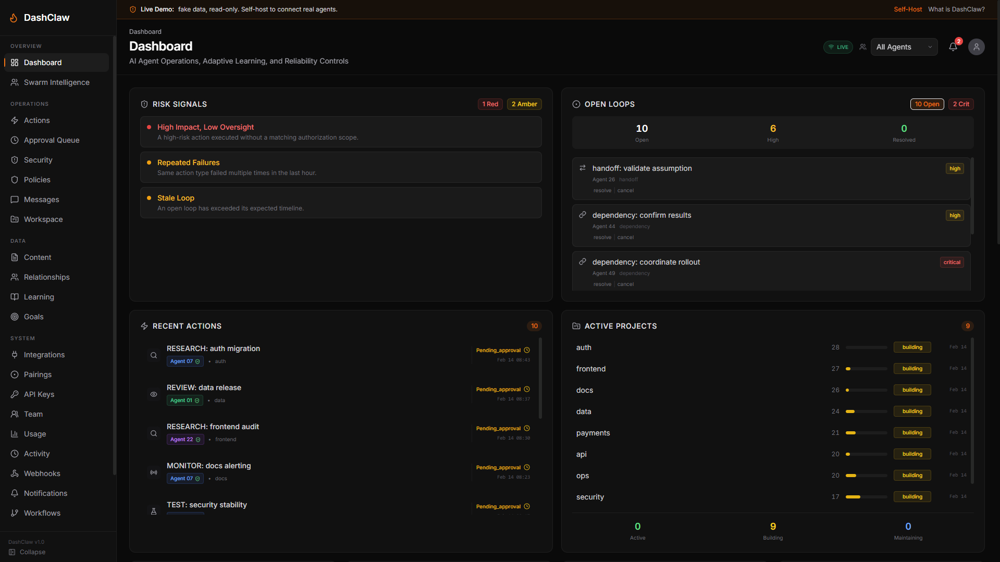
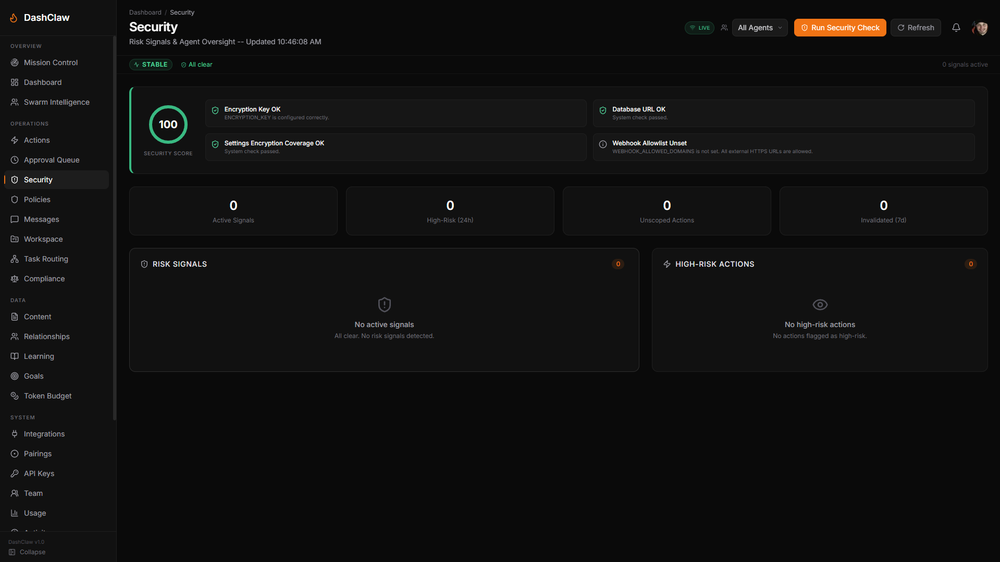
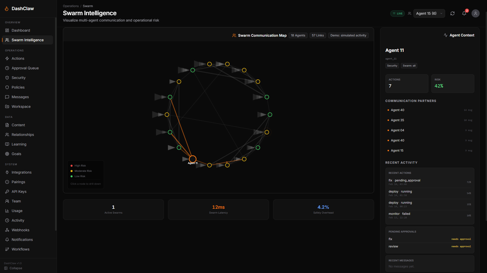

# [DashClaw:](https://www.dashclaw.io/) AI Agent Observability and Governance Platform


## It Combines

- A customer-facing website (`/`) and operations dashboard (`/dashboard`)
- A live demo sandbox (`/demo`) that shows the real dashboard UI with fake data (read-only, no login)
- A Next.js API control plane (`app/api/*`)
- Realtime SSE streaming with replay (`/api/stream`)
- Node and Python SDKs for agent instrumentation
- A local Python agent-tool suite for workflow, memory, and security operations

## What This Repository Contains

- `app/`: Next.js App Router pages, dashboard UI, API routes, shared libraries
- `sdk/`: Node.js SDK (`dashclaw`)
- `sdk-python/`: Python SDK (`dashclaw`)
- `agent-tools/`: Local Python CLI tool suite with optional dashboard sync
- `scripts/`: migrations, CI guards, API contract checks, and reliability evidence tooling
- `docs/`: RFCs, runbooks, parity matrix, governance docs
- `PROJECT_DETAILS.md`: deep architecture and behavior reference

## Product Surfaces

- `http://localhost:3000/`: public/customer-facing site
- `http://localhost:3000/demo`: live demo (real UI, fake data, read-only, no login)
- `http://localhost:3000/self-host`: self-host instructions
- `http://localhost:3000/dashboard`: operations dashboard
  - Demo: public + fake data
  - Self-host: your data (requires auth in production)
- `http://localhost:3000/docs`: SDK and platform documentation
- `http://localhost:3000/toolkit`: agent tools overview

## Architecture At A Glance

1. `middleware.js`
   - Auth, API-key resolution, org-scoping headers, CORS, rate limiting
2. `app/api/*`
   - Multi-tenant API routes for actions, guardrails, webhooks, messaging, context, workspace data
3. `app/lib/*`
   - Domain logic for validation, security scanning, signals, guard evaluation, realtime events
4. `app/components/*`
   - Dashboard widgets and layout system
5. `app/lib/events.js` + `app/api/stream/route.js`
   - Realtime broker abstraction (memory/redis), SSE fanout, Last-Event-ID replay
6. `sdk/` and `sdk-python/`
   - Agent client APIs mapped to the same platform endpoints

## Runtime Flow

1. Client or SDK calls API with NextAuth cookie (browser) or `x-api-key` (external).
2. Middleware resolves org and role, injects `x-org-id` and `x-org-role`.
3. Route handler validates input and executes domain/repository logic.
4. Critical events publish through realtime backend for SSE subscribers.
5. Dashboard/UI consumes API data + realtime updates.
6. CI gates enforce contracts, SQL guardrails, docs consistency, SDK parity, and latency regression checks.

## 

## Quick Start (Local)

### Prerequisites

- Node.js 20+
- npm 10+
- PostgreSQL-compatible database (Neon recommended)

### 1) Install

```bash
git clone https://github.com/ucsandman/DashClaw.git
cd DashClaw
npm install
```

### 2) Configure environment

```bash
cp .env.example .env.local
```

Fast path: generate the required secrets + an admin API key (and keep your existing values if re-running):

```bash
# Requires DATABASE_URL to be set (either in your shell or passed via --database-url)
node scripts/init-self-host-env.mjs --database-url "postgresql://..."
```

Minimum variables (self-host):
- `DATABASE_URL` (Postgres)
- `NEXTAUTH_URL` + `NEXTAUTH_SECRET`
- `DASHCLAW_API_KEY` (required for production deployments; strongly recommended locally)

### 3) Run migrations (idempotent)

```bash
node scripts/_run-with-env.mjs scripts/migrate-multi-tenant.mjs
node scripts/_run-with-env.mjs scripts/migrate-cost-analytics.mjs
node scripts/_run-with-env.mjs scripts/migrate-identity-binding.mjs
```

Optional:

```bash
node scripts/_run-with-env.mjs scripts/migrate-behavioral-ai.mjs
node scripts/_run-with-env.mjs scripts/migrate-learning-loop-mvp.mjs
```

### 4) Start app

```bash
npm run dev
```

Open `http://localhost:3000`.

## Core Commands

### Development

```bash
npm run dev
npm run build
npm run start
```

### Quality and CI Parity

```bash
npm run lint
npm run docs:check
npm run openapi:check
npm run api:inventory:check
npm run route-sql:check
npm run test -- --run
npm run sdk:integration
npm run sdk:integration:python
```

### Archived Program Checks (Historical)

```bash
npm run reliability:ws1:check
npm run reliability:evidence -- http://localhost:3000 docs/rfcs/platform-convergence-evidence.json
```

### Adaptive Learning Loop Ops

```bash
npm run migrate:learning-loop
npm run backfill:learning-episodes
npm run rebuild:learning-recommendations
```

## SDKs

### Node SDK (`sdk/`)

Install:

```bash
npm install dashclaw
```

Usage:

```js
import { DashClaw } from 'dashclaw';

const claw = new DashClaw({
  baseUrl: 'http://localhost:3000',
  apiKey: process.env.DASHCLAW_API_KEY,
  agentId: 'my-agent',
});
```

### Python SDK (`sdk-python/`)

Install:

```bash
cd sdk-python
pip install .
```

Usage:

```python
from dashclaw import DashClaw

claw = DashClaw(
    base_url="http://localhost:3000",
    api_key="YOUR_API_KEY",
    agent_id="my-agent",
)
```

## Agent Tools

`agent-tools/` contains local-first Python utilities for:
- learning and decisions
- goals and relationships
- context and session handoffs
- memory health and search
- security scanning and audit logging
- snippet automation and bulk sync

Most tools support `--push` to sync data to DashClaw APIs.

## Adaptive Learning Loop (MVP)

- Episode scoring is captured on action outcome updates (`PATCH /api/actions/{actionId}`).
- Recommendations are served from `/api/learning/recommendations` (`GET`) with optional telemetry tracking.
- Recommendation rebuild (`POST /api/learning/recommendations`) is restricted to admin/service role.
- Recommendation telemetry ingestion: `POST /api/learning/recommendations/events`.
- Recommendation effectiveness metrics: `GET /api/learning/recommendations/metrics`.
- Recommendation ops toggle: `PATCH /api/learning/recommendations/{recommendationId}`.
- SDK safe auto-adapt modes:
  - Node: `autoRecommend: 'off' | 'warn' | 'enforce'`
  - Python: `auto_recommend='off' | 'warn' | 'enforce'`
- Automated repair/rebuild cron routes:
  - `/api/cron/learning-episodes-backfill`
  - `/api/cron/learning-recommendations`

## Swarm Intelligence

- Swarm Intelligence (multi-agent map): See how your agents coordinate in real time, with communication edges and per-agent context so you can spot bottlenecks, risky hubs, and “who depends on who” at a glance.
- Click-to-drill: Select any agent node to pull up its recent actions, messages, guard decisions, workflows, and pending approvals.
- Operational clarity: Makes emergent behavior visible so you can catch runaway loops, fragile dependencies, and high-risk clusters before they become incidents.

## Security Model

- Multi-tenant org scoping on all protected APIs
- API key hashing and role-bound access
- NextAuth session support for dashboard users
- CORS controls and rate limiting in middleware
- Guard policy engine (`/api/guard`, `/api/policies`)
- Optional behavioral AI and DLP/security finding routes

Security docs:
- `docs/SECURITY.md`
- `docs/SECURITY-CHECKLIST.md`
- `docs/SECURITY-AUDIT-TEMPLATE.md`

## Deployment

- Vercel config: `vercel.json`
- Docker support: `Dockerfile`, `docker-compose.yml`

For production, configure:
- `DATABASE_URL`
- `DASHCLAW_API_KEY`
- `NEXTAUTH_URL`
- `NEXTAUTH_SECRET`
- provider keys as needed (`GITHUB_*`, `GOOGLE_*`, `STRIPE_*`, `RESEND_API_KEY`, `CRON_SECRET`)

## Documentation Map

- Architecture and behavior: `PROJECT_DETAILS.md`
- Quick non-coding setup: `QUICK-START.md`
- Documentation governance: `docs/documentation-governance.md`
- Archived platform convergence RFC: `docs/rfcs/platform-convergence.md`
- Archived platform convergence status log: `docs/rfcs/platform-convergence-status.md`
- Archived convergence evidence artifact: `docs/rfcs/platform-convergence-evidence.json`
- SDK parity matrix: `docs/sdk-parity.md`
- SSE cutover runbook: `docs/rfcs/2026-02-13-sse-cutover-runbook.md`
- Contribution guide: `CONTRIBUTING.md`

# **More screenshots in /public/images/screenshots**

## Contributing

See `CONTRIBUTING.md`.

## License

MIT (`LICENSE`).

## Tips (I'm broke)

Coffee: [Buy me a coffee](https://buymeacoffee.com/wes_sander)

Venmo: [@Wes_Sander](https://account.venmo.com/u/Wes_Sander)


